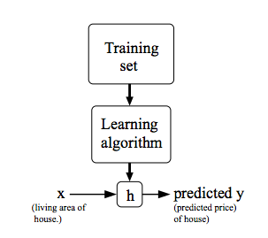

# 개요
머신러닝은 수많은 분야에서 사용되고 있다. 그리고 우리 또한 알게 모르게 머신러닝 기술을 사용하고 있다. Google과 같은 웹 검색 엔진을 사용할 때마다 인터넷 검색이 잘되는 이유 중 하나는 알고리즘이 순위를 매겨 우리에게 보여주기 때문이다. Apple, Facebook과 같이 사진을 통해 친구를 인식하는 것 또한 머신러닝의 분야이다.   
* Data mining :  web click data(click stream data), medical records, biology, engineering
* App can't program by hand : 자율 주행, handwriting recognition, Natural Language Processing(NLP), Computer Vision  

# 머신러닝이란?
1. Arthur Samuel : 명시적으로 프로그래밍 하지 않고도 컴퓨터가 스스로 학습할 수 있는 능력을 부여하는 연구분야
2. Tom Mitchell : 프로그램이 일정 수준의 작업 성능(P)을 가지고 작업(T)을 수행할 때, 경험(E)가 증가함에 따라 작업(T)를 수행하는 성능(P)가 향상될 수 있다.  
예를 들어, 
  
* T = 체스를 두는 일  
* E = 체스 게임을 많이 한 경험  
* P = 프로그램이 다음 게임에서 이길 확률  

# Supervised Learning
일반적으로 머신러닝 문제는 지도학습과 비지도학습의 범주에 포함된다.  
* 지도학습이란? 훈련 데이터로부터 하나의 함수를 유추해내기 위한 방법이며 **정답(label)을 이미 알고 있다.**
* Regression(회귀) : 연속형 변수를 예측한다. ex) 부동산 시장의 주택 크기에 대한 가격 예측 - [01_Regression.ipynb](https://github.com/Devkya/Coursera/blob/master/lecture_code/01_Regression.ipynb)
* Classification(분류) : 범주형 변수를 예측한다. ex) 종양이 악성인지 양성인지 예측 - [02_Classification.ipynb](https://github.com/Devkya/Coursera/blob/master/lecture_code/02_classification.ipynb)

# Unsupervised Learning
* 결과가 어떤 모습이어야 하는지 거의 또는 전혀 모르는 상태로 문제에 접근할 수 있다. 즉 정답(label)이 없다. 데이터의 변수 간의 관계를 기반으로 군집화(clustering)한다.
* clustering(군집화) : 수많은 서로 다른 유전자 데이터를 수명, 위치, 역할 등과 같은 다양한 변수에 의해 그룹화시킨다.
* 칵테이 파티 알고리즘 : 개별 목소리와 음악을 식별함.

# Model 표현
m = Number of training examples  
x = feature/input variable  
y = class/target/output variable  
  
* hypothesis란?  
h : X -> Y => x에 대한 ydml

